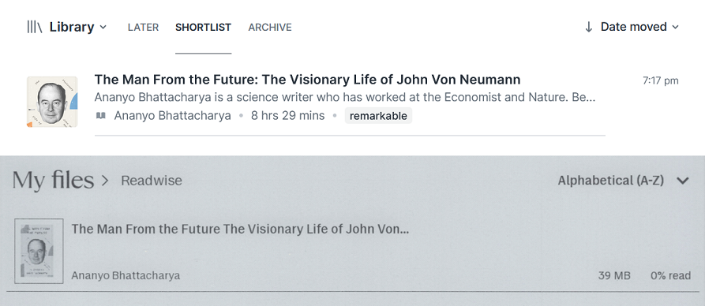

# Readwise to reMarkable



Automatically syncs documents from Readwise Reader to your reMarkable tablet. The tool looks for documents tagged with "remarkable" in specific locations (new, later, shortlist) and uploads them to your reMarkable cloud using rmapi.

## Installation

You need [rmapi](https://github.com/ddvk/rmapi) to upload files to your reMarkable.

Also, you need a [Readwise access token](https://readwise.io/access_token) to authenticate with the Readwise API.

1. Clone this repository:
```bash
git clone https://github.com/donmerendolo/readwise-to-remarkable
cd readwise-to-remarkable
```

2. Install requirements:
```bash
pip install -r requirements.txt
```
(recommended to use a virtual environment)

3. Edit `config.cfg` with your settings (you should only have to set the access token):
```ini
[readwise]
access_token = your_readwise_access_token_here

[remarkable]
rmapi_path = rmapi
folder = Readwise

[sync]
locations = new,later,shortlist
tag = remarkable
```

## Usage

1. Add tag `remarkable` to documents in Readwise Reader that you want to sync.
2. Run the tool:
```bash
python readwise_to_remarkable.py
```
3. Profit!

## Configuration Options

### Readwise Settings
- `access_token`: Your Readwise access token

### reMarkable Settings
- `rmapi_path`: Path to rmapi executable (use full path if not in system PATH)
- `folder`: Folder name on reMarkable where documents will be uploaded

### Sync Settings
- `locations`: Comma-separated list of Readwise locations to sync from
  - Options: `new`, `later`, `shortlist`, `archive`, `feed`
- `tag`: Tag name to filter documents by (default: "remarkable")
